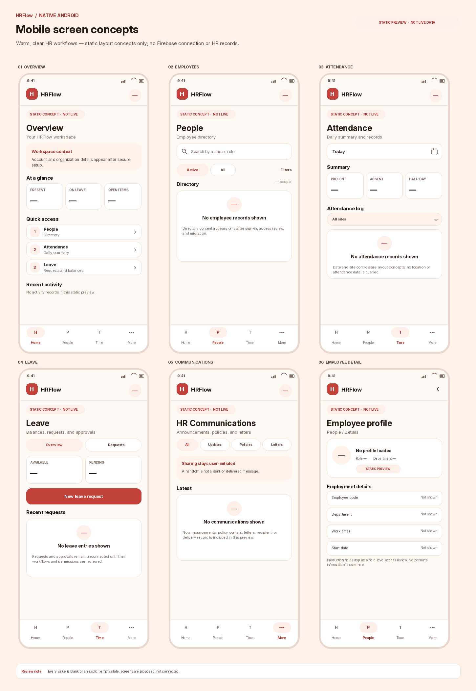

# HRFlow native Android foundation

This directory contains an independent Kotlin/Jetpack Compose Android app foundation for HRFlow. It does **not** replace or modify the existing React/Vite PWA or its Capacitor wrapper. The starter is limited to a Firebase setup gate, email/password sign-in, an authenticated mobile shell, a read-only listener for `users/{uid}`, and empty states for features that have not been migrated.

The product definition is in [the PRD](docs/HRFLOW_ANDROID_PRD.md), its layering and Firebase boundaries are described in [the architecture note](docs/ARCHITECTURE.md), and [the design tokens](docs/DESIGN_SYSTEM.md) describe the warm, coral-accented native direction and bundled Inter font. See the [screen map](docs/SCREEN_MAP.md), [performance goals](docs/PERFORMANCE.md), and [setup instructions](docs/SETUP.md) for the migration sequence and verification steps.

## Review the proposed mobile pages

The image below is a **static, non-live layout concept**. It contains no company, employee, attendance, leave, or communication records and does not connect to Firebase.

Separate phone-size screenshots and their reproducible rendering script are in `design-preview/`.

## Current starter boundary

The starter uses Firebase Android SDKs and the existing PWA's Firebase data paths, but waits for app-specific Firebase Android configuration before showing the sign-in flow or loading HR data. It does not guess a Firebase Android App ID or a registered application ID. Until configuration is added locally, the launch screen explains the setup steps.

After setup and sign-in, the only HR document currently read is the signed-in account's `users/{uid}` profile. The starter does not query organization collections, employees, attendance, leave, role documents, or communications, and performs no Firestore writes. The default Gradle application ID `com.example.hrflow` is a build placeholder and **must be replaced before Firebase registration or release**.

## Build entry point

Open `native-android/` as a standalone Android Studio project after installing Android SDK API 36 and selecting the final application ID. The Gradle wrapper pins 8.13; see [setup](docs/SETUP.md) for local Firebase configuration and build commands. The implementation computer had JDK 21 but no Android SDK, `adb`, `sdkmanager`, or system Gradle, so a device build and runtime test still need to be performed on an Android-equipped computer.
